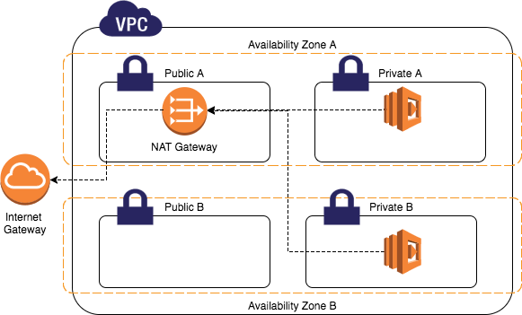

# awsvpc
## AWS — Difference between Internet Gateway and NAT Gateway
Comparison: Internet gateway (IGW) vs NAT gateway (NGW) in AWS.

### 
Internet Gateway (IGW) allows instances with public IPs to access the internet.
NAT Gateway (NGW) allows instances with no public IPs to access the internet.

### Internet Gateway
An Internet Gateway (IGW) is a logical connection between an Amazon VPC and the Internet. It is not a physical device. Only one can be associated with each VPC. It does not limit the bandwidth of Internet connectivity. (The only limitation on bandwidth is the size of the Amazon EC2 instance, and it applies to all traffic — internal to the VPC and out to the Internet.)

If a VPC does not have an Internet Gateway, then the resources in the VPC cannot be accessed from the Internet (unless the traffic flows via a corporate network and VPN/Direct Connect).
An Internet Gateway allows resources within your VPC to access the internet, and vice versa. In order for this to happen, there needs to be a routing table entry allowing a subnet to access the IGW.

That is to say — an IGW allows resources within your public subnet to access the internet, and the internet to access said resources.
A subnet is deemed to be a Public Subnet if it has a Route Table that directs traffic to the Internet Gateway.

### NAT Gateway
A NAT Gateway does something similar, but with two main differences:
- It allows resources in a private subnet to access the internet (think yum updates, external database connections, wget calls, OS patch, etc).
- It only works one way. The internet at large cannot get through your NAT to your private resources unless you explicitly allow it.
AWS introduced a NAT Gateway Service that can take the place of a NAT Instance. The benefits of using a NAT Gateway service are:
- It is a fully-managed service — just create it and it works automatically, including fail-over.
- A NAT gateway supports 5 Gbps of bandwidth and automatically scales up to 45 Gbps. (a NAT Instance is limited to the bandwidth associated with the EC2 instance type).

**However:**
Security Groups cannot be associated with a NAT Gateway.
You’ll need one in each AZ since they only operate in a single AZ.